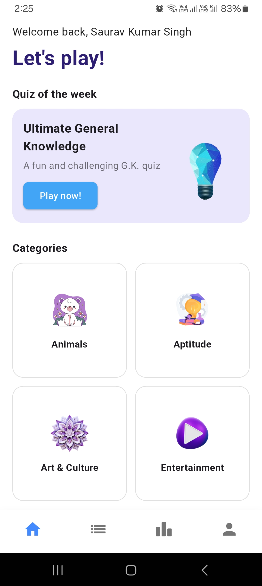
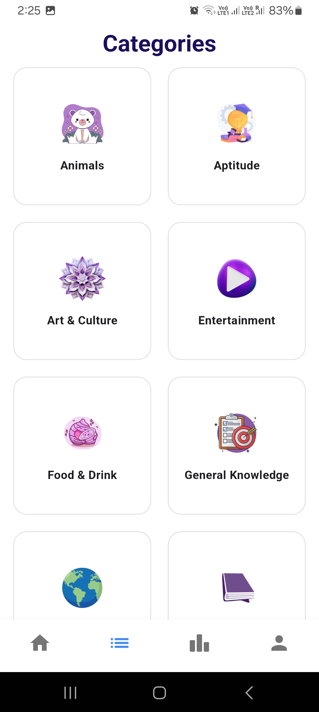
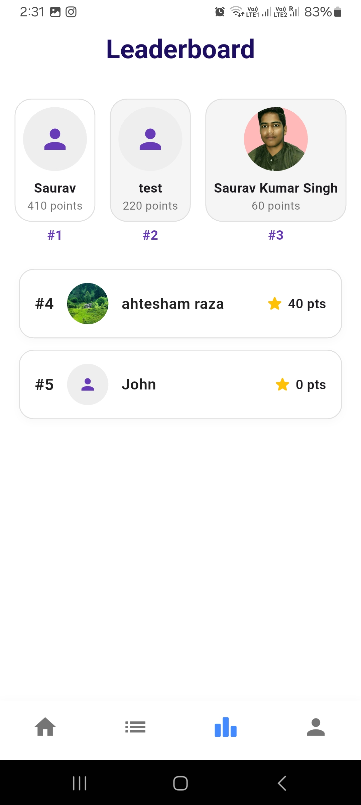
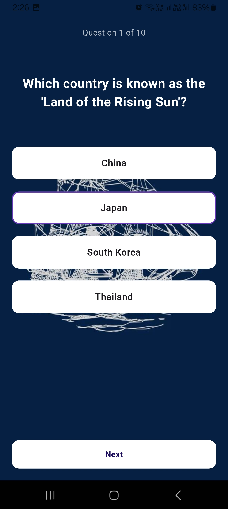
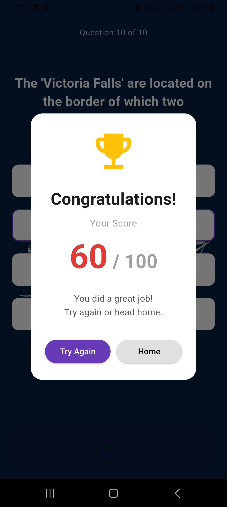
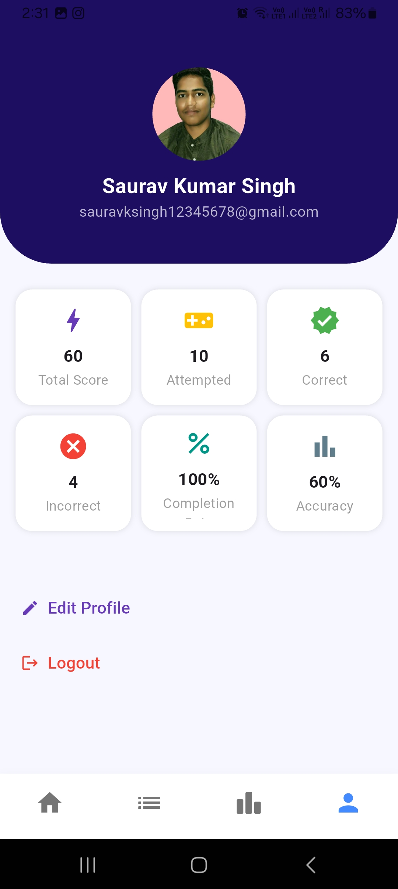

# 🎯 Quizopia - Flutter Quiz App

Quizopia is a modern, interactive mobile quiz application built with **Flutter** and **Firebase**. Challenge your knowledge across various categories, compete on leaderboards, and track your progress in real-time!

---
## 📦 Download APK

Want to try Quizopia without setting up the code?

👉 **[Download Latest APK](https://github.com/Saurav-KumarSingh/quizopia/raw/main/screenshots/app-release.apk)**

> *(Click the link above to download and install the APK on your Android device)*

---

## ✨ Features

* **🔐 Secure Authentication:** Seamless user sign-up and login powered by Firebase Authentication.
* **🧠 Dynamic Quizzes:** Engage with a rotating "Quiz of the Week" and explore a wide range of category-based quizzes.
* **✅ Real-Time Scoring:** Get instant feedback and track your score as you play.
* **🏆 Global Leaderboard:** See how you stack up against other players with a live, ranked leaderboard.
* **🧍 Personalized Profiles:** Manage your profile, update your details, and personalize your experience.
* **☁️ Cloudinary Integration:** Effortlessly upload and manage your profile pictures.
* **🚀 Robust Backend:** Powered by Firebase Firestore for real-time data synchronization.
* **📱 Responsive UI:** Enjoy a clean and intuitive user interface optimized for various screen sizes.

---

## 📸 Screenshots

<p align="center">

  
  
  
  <br />
  
  
  

</p>

---

## 🚀 Getting Started

Follow these steps to get Quizopia up and running on your local machine.

### 1. Clone the Repository

```bash
git clone [https://github.com/Saurav-KumarSingh/quizopia.git](https://github.com/Saurav-KumarSingh/quizopia.git)
cd quizopia
```
###2. Install Dependencies

```bash
flutter pub get
```
###3. Firebase & Cloudinary Setup
<br />
###4. Configure Environment Variables

```
CLOUDINARY_API_KEY=your_cloudinary_api_key_here
CLOUDINARY_API_SECRET=your_cloudinary_api_secret_here
CLOUDINARY_UPLOAD_PRESET=quizopia # Or your custom preset name
CLOUDINARY_CLOUD_NAME=your_cloudinary_cloud_name_here
```
```
flutter run
